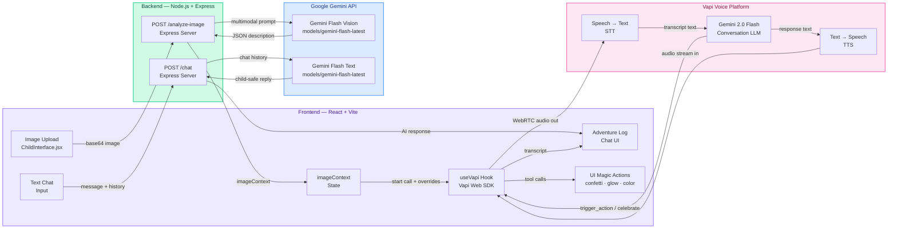

<div align="center">

<pre>
███╗   ███╗ █████╗  ██████╗ ██╗ ██████╗
████╗ ████║██╔══██╗██╔════╝ ██║██╔════╝
██╔████╔██║███████║██║  ███╗██║██║
██║╚██╔╝██║██╔══██║██║   ██║██║██║
██║ ╚═╝ ██║██║  ██║╚██████╔╝██║╚██████╗
╚═╝     ╚═╝╚═╝  ╚═╝ ╚═════╝ ╚═╝ ╚═════╝

██████╗  ██████╗ ██████╗  ██████╗ ████████╗
██╔══██╗██╔═══██╗██╔══██╗██╔═══██╗╚══██╔══╝
██████╔╝██║   ██║██████╔╝██║   ██║   ██║
██╔══██╗██║   ██║██╔══██╗██║   ██║   ██║
██║  ██║╚██████╔╝██████╔╝╚██████╔╝   ██║
╚═╝  ╚═╝ ╚═════╝ ╚═════╝  ╚═════╝    ╚═╝
</pre>

#  Magic Robot Adventure 

### *Real-time AI voice conversations for curious little minds*

<br/>

[](https://reactjs.org/)
[](https://ai.google.dev/)
[](https://vapi.ai/)
[](https://nodejs.org/)

<br/>

>  *Upload a photo. Watch the magic begin. Let your child talk to an AI that truly sees.*

<br/>

---

</div>

<br/>

##  What is Magic Robot Adventure?

**Magic Robot Adventure** is a real-time, AI-powered voice conversation app designed for children aged **4–8 years old**. Children upload any image — a drawing, a toy, a pet — and **Roby the Magic Robot** springs to life, analyzes the image with Google Gemini Vision, and launches into a **1-minute interactive voice adventure** about what it sees.

It's not just a chatbot. It's a *magical companion* that listens, responds, cheers, and celebrates — all in real time.

<br/>

---

##  Feature Highlights

| Feature | Description |
|---|---|
|  **Image Intelligence** | Powered by Gemini Flash Vision — analyzes any child-uploaded photo in seconds |
|  **Live Voice Conversations** | Real-time two-way voice powered by Vapi AI with sub-second latency |
|  **Timed Adventure Sessions** | Structured 60-second interactive sessions — just right for little attention spans |
|  **Magic UI Actions** | AI can trigger live UI effects: confetti explosions, glowing highlights, color bursts |
|  **Text Chat Fallback** | Full text-based chat with Gemini when voice isn't available |
|  **Animated Storybook UI** | Framer Motion animations, floating clouds, bouncing robot — pure childhood wonder |
|  **Child-Safe Responses** | Every prompt is guardrailed for age-appropriate, joyful, safe interactions |

<br/>

---

##  Architecture



<br/>

---

##  Quick Start

### Prerequisites

- Node.js `v18+`
- A [Google AI Studio](https://aistudio.google.com/) API Key (Gemini)
- A [Vapi](https://vapi.ai/) account with a configured Assistant

<br/>

### 1️⃣ Clone & Install

```bash
# Clone the repository
git clone https://github.com/your-username/magic-robot-adventure.git
cd magic-robot-adventure

# Install frontend dependencies
cd frontend && npm install

# Install backend dependencies
cd ../backend && npm install
```

<br/>

### 2️⃣ Configure Environment

Create a `.env` file in the **root** directory:

```env
# ─────────────────────────────────────────
#   Magic Robot Adventure — Environment
# ─────────────────────────────────────────

# Google Gemini API Key (from aistudio.google.com)
GEMINI_API_KEY=your_gemini_api_key_here

# Vapi Voice Platform Keys (from app.vapi.ai)
VITE_VAPI_PUBLIC_KEY=your_vapi_public_key_here
VITE_VAPI_ASSISTANT_ID=your_vapi_assistant_id_here

# Optional
PORT=3001
```

>  **Important:** Use your Vapi **Public Key** — not the Secret Key.

<br/>

### 3️⃣ Configure Your Vapi Assistant

In your [Vapi Dashboard](https://app.vapi.ai), create an assistant with:

- **Model:** `Gemini 2.0 Flash` (Google provider)
- **System Prompt:** *(Injected dynamically via overrides — see `useVapi.js`)*
- **Voice:** Any child-friendly TTS voice
- **Tools:** `trigger_action`, `celebrate`, `session_complete`

<br/>

### 4️⃣ Launch 

```bash
# Terminal 1 — Start the backend
cd backend && npm run dev

# Terminal 2 — Start the frontend
cd frontend && npm run dev
```

Open your browser at **`http://localhost:5173`** and let the adventure begin! 

<br/>

---

##  The Magic Flow

```
  [ Child uploads photo ]
          │
          ▼
   Gemini Vision analyzes image
     Returns: objects, colors, mood, description
          │
          ▼
   Roby introduces herself & describes the image
          │
          ▼
   Vapi starts a 60-second voice conversation
     Child speaks → STT → Gemini responds → TTS
          │
          ▼
   UI Magic Actions fire during conversation:
     • Confetti explosions     
     • Background color shifts 
     • Object highlights       
     • Celebration banners     
          │
          ▼
   Timer hits 0 → Celebration confetti burst
   Session ends with a big "AMAZING JOB!" 
```

<br/>

---

##  Tech Stack

### Frontend
| Package | Purpose |
|---|---|
| `React 18` | UI framework |
| `Framer Motion` | Fluid animations & transitions |
| `@vapi-ai/web` | Real-time voice AI SDK |
| `canvas-confetti` | Celebration effects |
| `Lucide React` | Icon library |
| `Tailwind CSS` | Utility-first styling |

### Backend
| Package | Purpose |
|---|---|
| `Express.js` | REST API server |
| `@google/generative-ai` | Gemini Vision + Chat SDK |
| `cors` | Cross-origin resource sharing |
| `dotenv` | Environment variable management |

### AI Services
| Service | Usage |
|---|---|
| **Gemini Flash Vision** | Image analysis & multimodal understanding |
| **Gemini Flash Text** | Fallback chat completions |
| **Vapi Voice Platform** | Real-time STT, TTS, & conversation orchestration |

<br/>

---

##  Project Structure

```
child5/                               #  Project root
│
├── 📁 node_modules/                  # Installed dependencies
├── 📁 public/                        # Static assets (favicon, images)
│
├── 📁 server/                        #  Backend — Node.js + Express
│   └── server.js                     #    REST API: /analyze-image · /chat · /health
│                                     #    Gemini Vision + Chat integration
│
├── 📁 src/                           #  Frontend — React + Vite
│   ├── 📁 components/
│   │   └── ChildInterface.jsx        #    Main UI: image upload, chat log, mic button
│   ├── 📁 hooks/
│   │   └── useVapi.js                #    Vapi voice hook: STT/TTS, tool calls, transcript
│   └── main.jsx                      #    React app entry point
│
├──   .env                          #  Secret API keys (gitignored!)
├──  .env.example                   #    Key template for new contributors
├──  .gitignore                     #    Ignores node_modules, .env, dist
├──  eslint.config.js               #    Linting rules
├──  index.html                     #    Vite HTML entry point
├──  package-lock.json              #    Locked dependency tree
├──  package.json                   #    Scripts & dependencies
├──  postcss.config.js              #    PostCSS (Tailwind pipeline)
├──  README.md                      #    You are here! 
├──  tailwind.config.js             #    Tailwind CSS config + custom fonts
└──  vite.config.js                 #    Vite bundler config
```

<br/>

---

##  UI Tool Actions

The AI can trigger real-time UI effects during conversation via tool calls:

| Tool Call | Visual Effect |
|---|---|
| `add_sparkle_effect` | Dual confetti burst from sides  |
| `change_background_color` | Screen glows golden for 3 seconds  |
| `highlight_object` | Yellow pulsing glow around image  |
| `zoom_on_object` | Image scales up to draw focus |
| `animate_object` | Playful wobble animation  |
| `celebrate` | Full celebration: confetti + banner  |

<br/>

---

##  Security & Safety

-  All AI prompts are scoped for **child-safe** content (ages 4–8)
-  Gemini responses are guardrailed to avoid fantasy/misinformation
-  API keys are stored in `.env` and **never exposed** to the frontend
- Image data is processed server-side and not persisted
-  Voice sessions are time-limited to 60 seconds

<br/>

---

##  Google Gemini API — Deep Dive

Magic Robot Adventure uses **Gemini Flash** for two distinct AI tasks:

###  Vision Analysis — `POST /analyze-image`

```js
const model = genAI.getGenerativeModel({
  model: "models/gemini-flash-latest",
  generationConfig: { responseMimeType: "application/json" }
});
```

The image is sent as **base64 inline data** alongside a structured prompt. Gemini returns a strict JSON object:

```json
{
  "main_object": "a golden retriever puppy",
  "colors": ["golden", "brown", "white"],
  "action": "sitting and wagging tail",
  "mood": "happy",
  "literal_description": "There is a fluffy golden puppy sitting on green grass..."
}
```

>  `responseMimeType: "application/json"` forces Gemini to return valid JSON — no markdown fences, no preamble.

###  Text Chat — `POST /chat`

```js
const model = genAI.getGenerativeModel({ model: "models/gemini-flash-latest" });
const chat = model.startChat({ history: validHistory });
const result = await chat.sendMessage(childPrompt);
```

Full conversation history is passed with each request. Role mapping:

| Frontend Role | Gemini Role |
|---|---|
| `user` | `user` |
| `assistant` | `model` |

History is validated to always **start with a `user` turn** — a strict Gemini requirement.

###  Check Your Available Models

Run this utility to see all Gemini models accessible with your API key:

```bash
cd server
node listModels.js
```

Expected output:
```
--- Available Models ---
- models/gemini-flash-latest (Gemini Flash Latest)
- models/gemini-2.0-flash (Gemini 2.0 Flash)
- models/gemini-1.5-pro (Gemini 1.5 Pro)
...
```

---

##  Development Tips

**Check available Gemini models:**
```bash
cd backend
node listModels.js
```

**Test backend health:**
```bash
curl http://localhost:3001/health
```

**Test image analysis:**
```bash
curl -X POST http://localhost:3001/analyze-image \
  -H "Content-Type: application/json" \
  -d '{"image": "data:image/jpeg;base64,..."}'
```

<br/>

---

##  Built For

<div align="center">

*This project was built as a task submission for the **Speak with Zubi** shortlist challenge.*

*Objective: Real-time AI conversation — Image → 1-Minute Child Interaction*

<br/>

**Evaluation criteria:** Quality of child-AI interaction · UX polish · Tool call implementation

</div>

<br/>

---

<div align="center">

Made with 💜 for little adventurers everywhere

*"The best technology disappears — and becomes pure magic."*

<br/>

 **Star this repo if Roby made you smile!** 

</div>
